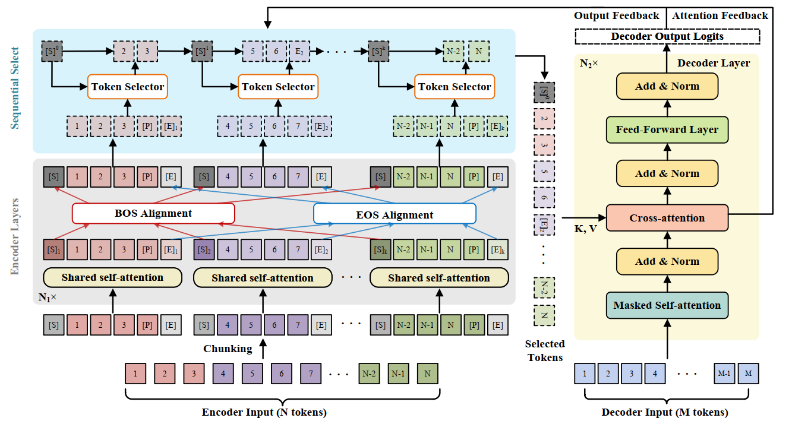

# SimCAS
The repository contains the code, data, and trained model for the paper [Chunk, Align, Select: A Simple Long-sequence Processing Method for Transformers](https://arxiv.org/abs/2308.13191#).
## Quick Links
- [Recap]()
- [Installation]()
- [Training]()
- [Inference]()
## Recap
In this paper, we propose a simple three-stage framework to propose long-sequence input for transformers.

## Installation
- `conda create --name env --file spec-file.txt`
- `pip install -r requirements.txt`
- using `compare_mt` -> https://github.com/neulab/compare-mt
  ```console
  git clone https://github.com/neulab/compare-mt.git
  cd ./compare-mt
  pip install -r requirements.txt
  python setup.py install
  ```
