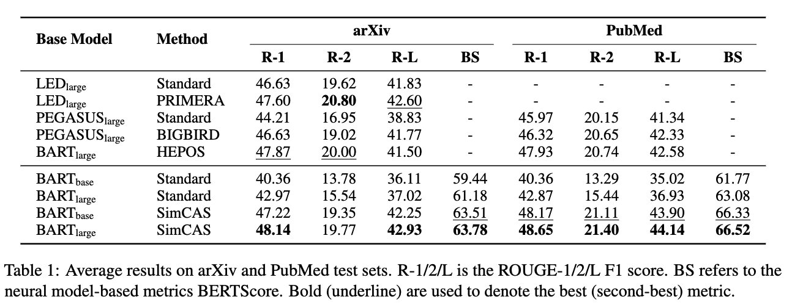

# SimCAS
[](https://github.com/xjw-nlp/SimCAS/blob/main/LICENSE)
[](https://github.com/xjw-nlp/SimCAS/blob/main/DATA_LICENSE)
[](https://github.com/SafeAILab/RAIN/issues) 
[](https://github.com/SafeAILab/RAIN/pulls)
[](https://www.python.org/downloads/release/python-380/)

The repository contains the source code, data, and models for the paper [Chunk, Align, Select: A Simple Long-sequence Processing Method for Transformers](https://aclanthology.org/2024.acl-long.729/), ACL 2024.
## Quick Links
- [Recap](#recap)
- [Requirements](#requirements)
- [Installation](#installation)
- [Datasets](#datasets)
- [Training](#training)
- [Trained Models](#trained-models)
- [Evaluation](#evaluation)
- [Results](#results)

## Recap
In this paper, we propose a simple three-stage framework to process long-sequence input for transformers.


## Requirements
+ python >= 3.8
+ transformers = 4.42.4
+ pytorch >= 1.9.0
+ datasets >= 2.10.0
+ evaluate >= 0.4.2
## Installation
- `conda create --name env --file spec-file.txt`
- `pip install -r requirements.txt`
- Using `compare_mt` -> https://github.com/neulab/compare-mt
  ```console
  git clone https://github.com/neulab/compare-mt.git
  cd ./compare-mt
  pip install -r requirements.txt
  python setup.py install
  ```
- (Optional) For the ROUGE calculation with the standard Perl package from [here](https://github.com/summanlp/evaluation/tree/master/ROUGE-RELEASE-1.5.5).
  ```console
  # make sure perl and cpan is installed
  perl --version
  cpan --version

  # install XML::DOM
  # may need sudo
  sudo cpan XML::DOM
  
  # download ROUGE-1.5.5
  git clone https://github.com/summanlp/evaluation
  
  # ROUGE 1.5.5 can be found in evaluation/ROUGE-RELEASE-1.5.5
  export ROUGE=/absolute/path/to/ROUGE-RELEASE-1.5.5
  
  # Optional: setting environment variable
  echo "export ROUGE=\"${ROUGE}\"" >> ~/.bashrc
  source ~/.bashrc
  
  # modify the db file
  cd ${ROUGE}/data/WordNet-2.0-Exceptions/
  mv WordNet-2.0.exc.db WordNet-2.0.exc.db.bak
  ./buildExeptionDB.pl . exc WordNet-2.0.exc.db
  
  cd $ROUGE
  ./runROUGE-test.pl
  # if there is no error message, then you have successfully installed ROUGE
  ```
- For BERTScore, using evaluation tool from [here](https://github.com/Tiiiger/bert_score)

## Datasets
We use the following datasets for our experiments. 
- arXiv -> [https://github.com/armancohan/long-summarization](https://github.com/armancohan/long-summarization)
- PubMed -> [https://github.com/armancohan/long-summarization](https://github.com/armancohan/long-summarization)
- GovReport -> [https://github.com/luyang-huang96/LongDocSum](https://github.com/luyang-huang96/LongDocSum)
- SummScreen -> [https://github.com/mingdachen/SummScreen](https://github.com/mingdachen/SummScreen)
- Multi-News -> [https://github.com/Alex-Fabbri/Multi-News](https://github.com/Alex-Fabbri/Multi-News)
- WCEP -> [https://github.com/allenai/PRIMER](https://github.com/allenai/PRIMER)
- NarrativeQA -> [https://github.com/google-deepmind/narrativeqa](https://github.com/google-deepmind/narrativeqa)

The input length distribution for each dataset is as follows:


We also provide the preprocessed datasets: [arXiv](https://huggingface.co/datasets/JW-X/arxiv_bart_512), [PubMed](https://huggingface.co/datasets/JW-X/pubmed_bart_512), [GovReport](https://huggingface.co/datasets/JW-X/govreport_bart_512), [SummScreen](https://huggingface.co/datasets/JW-X/summscreen_bart_512), [Multi-News](https://huggingface.co/datasets/JW-X/multinews_bart_512), [WCEP](https://huggingface.co/datasets/JW-X/wcep_bart_512), [NarrativeQA](https://huggingface.co/datasets/JW-X/nrtv_bart_512).
| Dataset  |  Chunk Size | Hugging Face link |
| ------------- | ------------- | ------------- |
| GovReport | 512 | [JW-X/govreport_bart_512](https://huggingface.co/datasets/JW-X/govreport_bart_512)  |
| SummScreen  | 512  | [JW-X/summscreen_bart_512](https://huggingface.co/datasets/JW-X/summscreen_bart_512) |
| Arxiv | 512 | [JW-X/arxiv_bart_512](https://huggingface.co/datasets/JW-X/arxiv_bart_512) |
| PubMed  | 512 | [JW-X/pubmed_bart_512](https://huggingface.co/datasets/JW-X/pubmed_bart_512)  |
| Multi-News  | 512 | [JW-X/multinews_bart_512](https://huggingface.co/datasets/JW-X/multinews_bart_512)  |
| WCEP-10  | 512 | [JW-X/wcep_bart_512](https://huggingface.co/datasets/JW-X/wcep_bart_512)  |
| NarrativeQA  | 512 | [JW-X/nrtv_bart_512](https://huggingface.co/datasets/JW-X/nrtv_bart_512)  |
  
## Training
```console
python main.py --cuda --gpuid [list of gpuid] --config [name of config] -l -p [number of port]
```

## Trained Models

| Dataset  |  Method | Hugging Face link |
| ------------- | ------------- | ------------- |
| GovReport | BART-base + SimCAS  | [JW-X/simcas-bart-base-govreport-512](https://huggingface.co/JW-X/simcas-bart-base-govreport-512)  |
| SummScreen  | BART-base + SimCAS  | [JW-X/simcas-bart-base-summscreen-512](https://huggingface.co/JW-X/simcas-bart-base-summscreen-512) |
| Arxiv | BART-base + SimCAS  | [JW-X/simcas-bart-base-arxiv-512](https://huggingface.co/JW-X/simcas-bart-base-arxiv-512) |
| PubMed  | BART-base + SimCAS  | [JW-X/simcas-bart-base-pubmed-512](https://huggingface.co/JW-X/simcas-bart-base-pubmed-512)  |
| Multi-News  | BART-base + SimCAS  | [JW-X/simcas-bart-base-multinews-512](https://huggingface.co/JW-X/simcas-bart-base-multinews-512)  |
| WCEP-10  | BART-base + SimCAS  | [JW-X/simcas-bart-base-wcep-512](https://huggingface.co/JW-X/simcas-bart-base-wcep-512)  |
| NarrativeQA  | BART-base + SimCAS  | [JW-X/simcas-bart-base-nrtv-512](https://huggingface.co/JW-X/simcas-bart-base-nrtv-512)  |

## Evaluation
### Example on SummScreen
```console
python main.py --cuda --gpuid 0 --config summscreen -e --model_pt summscreen/model_generation.bin

export CLASSPATH=/nas/xiejiawen/stanford-corenlp-4.4.0/stanford-corenlp-4.4.0.jar
cat ./result/summscreen/test.out | java edu.stanford.nlp.process.PTBTokenizer -ioFileList -preserveLines > ./result/summscreen/test.out.tokenized
cat ./result/summscreen/test.target | java edu.stanford.nlp.process.PTBTokenizer -ioFileList -preserveLines > ./result/summscreen/test.target.tokenized
python cal_rouge.py --ref ./result/summscreen/test.target.tokenized --hyp ./result/summscreen/test.out.tokenized --type summscreen -l

python cal_rouge.py --ref ./result/summscreen/test.target.tokenized --hyp ./result/summscreen/test.out.tokenized --type summscreen -l -p
```

## Results



## Citation
```console
@inproceedings{xie-etal-2024-chunk,
    title = "Chunk, Align, Select: A Simple Long-sequence Processing Method for Transformers",
    author = "Xie, Jiawen  and
      Cheng, Pengyu  and
      Liang, Xiao  and
      Dai, Yong  and
      Du, Nan",
    editor = "Ku, Lun-Wei  and
      Martins, Andre  and
      Srikumar, Vivek",
    booktitle = "Proceedings of the 62nd Annual Meeting of the Association for Computational Linguistics (Volume 1: Long Papers)",
    month = aug,
    year = "2024",
    address = "Bangkok, Thailand",
    publisher = "Association for Computational Linguistics",
    url = "https://aclanthology.org/2024.acl-long.729",
    pages = "13500--13519",
    abstract = "Although dominant in natural language processing, transformer-based models still struggle with long-sequence processing, due to the computational costs of their self-attention operations, which increase exponentially as the length of the input sequence grows. To address this challenge, we propose a **Sim**ple framework to enhance the long-content processing of off-the-shelf pre-trained transformers via three steps: **C**hunk, **A**lign, and **S**elect (SimCAS). More specifically, we first divide each long-sequence input into a batch of chunks, then align the inter-chunk information during the encoding steps, and finally, select the most representative hidden states from the encoder for the decoding process. With our SimCAS, the computation and memory costs can be reduced to linear complexity. In experiments, we demonstrate the effectiveness of the proposed method on various real-world long-text summarization and reading comprehension tasks, in which SimCAS significantly outperforms prior long-sequence processing baselines. The code is at [https://github.com/xjw-nlp/SimCAS](https://github.com/xjw-nlp/SimCAS).",
}
```
